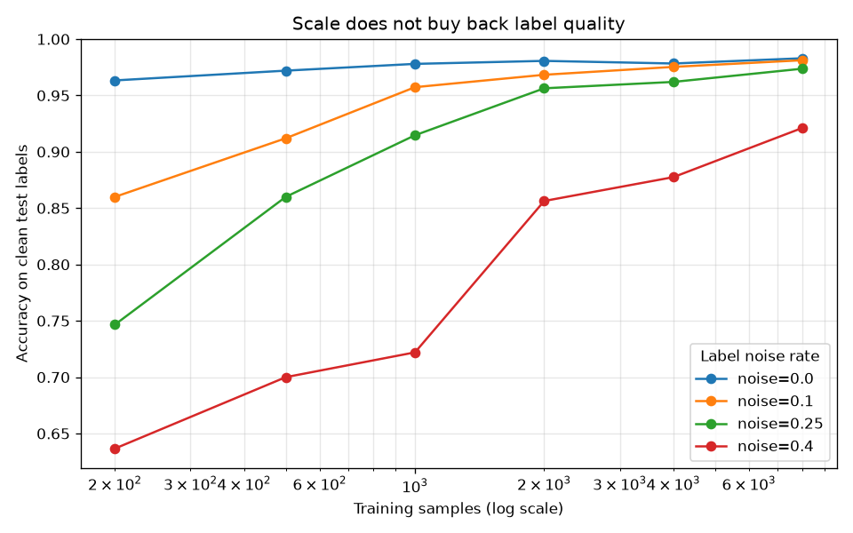

# label-quality-vs-quantity-benchmark

More data is not the fix if the data is garbage. This repo is a runnable argument for a claim that ought to be uncontroversial but somehow still needs shouting: in biology, **label quality beats label quantity**.

Train a model on a 25%-mislabelled dataset and you do not get biology. You get 25% garbage plus a very confident hallucination engine. This project shows that, on purpose, with synthetic data you can generate in seconds.

## Demo Output



The plot above was produced from simulated data by `demo.py`: it compares test accuracy as you scale sample size at several label-noise levels, showing that scale cannot buy back what noisy labels take away.

## Why This Exists

The headline framing in a lot of AI-for-biology writing is "the atlases are orders of magnitude too small." That invites everyone to spend their money on *more* rows. But public repositories already have enormous scale, and sample mislabelling as high as 25% has been documented. Your "MCF7" cells might be HeLa. You cannot condition on a label that was recorded wrong.

This repo lets you *feel* the tradeoff numerically. You dial in a noise rate, you dial in a sample count, and you watch the learning curves flatten out at a ceiling set by the noise, not by the data volume.

## What It Does

- Generates a synthetic two-class "expression" dataset with a controllable label-noise rate.
- Sweeps training-set size and noise rate.
- Trains a simple logistic-regression baseline (deliberately not a giant model).
- Reports the accuracy ceiling imposed by label noise.

## Quick Start

```bash
pip install -r requirements.txt
python demo.py            # self-contained, writes figures/ and results/
python noise_sweep.py --n-samples 2000 --noise 0.25
```

## The Decision Framework

Before you buy more data, ask which lever you are actually pulling.

| Situation | More data helps? | Cleaner labels help? | Do this |
|-----------|------------------|----------------------|---------|
| Labels are clean, model underfits | Yes | No | Add samples |
| Labels are ~10-25% noisy | Barely | A lot | Audit and relabel |
| Wrong context / modality entirely | No | No | Collect the right data |
| Missing metadata to filter on | No | No | Fix collection, not volume |

## When NOT to Use This

This is a teaching scaffold, not a QC pipeline. It will not detect contamination in your real data, will not deduplicate cell lines, and will not fix your free-text metadata. It exists to make one point crisply, then get out of your way.

## The Uncomfortable Truth

You can multiply a mislabelled dataset by 100x and the accuracy ceiling barely moves, because you multiplied the mistakes too. No architecture recovers a dimension of truth that was never measured correctly. Spend your next dollar on labels and metadata, not on more rows.

## Further Reading

Inspired by Ming 'Tommy' Tang, "AI in Drug Discovery: Data Quality, Not Quantity, Is the Bottleneck" (https://divingintogeneticsandgenomics.com/post/ai-drug-discovery-data-quality-not-quantity/).
